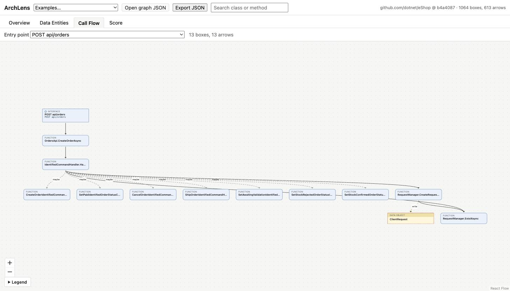

# ArchLens

Point it at a C# repo and get an ArchiMate-style architecture diagram: projects, services, HTTP entry points,
data entities, outside systems, and the arrows between them. No manual modeling.



**Core rule:** static analysis finds the facts (what exists, what calls what). The optional LLM step only labels
boxes the rules were unsure about. It can never add, remove or move an arrow, and every arrow carries the file
and line that proves it.

## Quick start

```bash
# analyzer (.NET 10 SDK)
dotnet test
dotnet run --project src/ArchLens.Cli -- analyze github.com/dotnet/eShop --out eshop.json
dotnet run --project src/ArchLens.Cli -- analyze ./path/to/local/repo --out graph.json

# viewer (Node 20+)
cd viewer && npm install && npm run dev      # open the page, then drop graph.json on it
```

Options: `--include-tests` (test projects are skipped by default), `--max-depth N` (call flow depth, default 8),
`--enrich` (LLM step, needs `ANTHROPIC_API_KEY`, see below).

## How it works

```
1 Load      one Roslyn compilation per .csproj, project references wired up, no NuGet restore
2 Collect   one pass over every file: DbSets, DI registrations, routes, HttpClient base URLs, migrations...
3 Classify  rules pick one of 10 fixed box types; entity score decides "is this data?"
4 Build     walk every method body: calls, data access, HTTP calls -> arrows with file:line evidence
5 Enrich    (optional) LLM labels only the boxes the rules marked unsure (confidence 0.5)
6 Trace     depth-first call flow from every HTTP entry point, stored in the JSON
7 Score     100 minus penalties from fixed graph checks
```

Steps 1 to 4, 6 and 7 are deterministic: the same commit always gives the same JSON (there is a test for this).

| Code | Becomes |
|---|---|
| `.csproj` | Application Component |
| Controller action, `MapGet/MapPost/...` route (with `MapGroup` prefixes) | Application Interface |
| Class with logic | Application Service (confidence 0.9 if DI-registered or implements a repo interface, else 0.5) |
| Method with a body | Application Function |
| Class with entity score >= 5 (2 to 4 = unsure) | Data Object (kind: stored / DTO / external) |
| Class deriving from `DbContext` | Technology Service |
| `HttpClient` call | External System, named from the URL or the `AddHttpClient<T>` base address |

| Arrow | Detected from |
|---|---|
| Serving | a method call or method passed as a delegate; interface calls follow DI registrations, else every implementation at confidence 0.5; `mediator.Send(cmd)` follows to the `IRequestHandler<Cmd>` |
| Access (read/write) | `DbSet` use (`Add/Update/Remove` = write), `context.Remove(x)`, setting a property on a stored entity, `GetFromJsonAsync<T>` |
| Flow | `HttpClient` calls to an External System |
| Aggregation | a data object's collection property of another data object |

Entity score (from the design doc): ORM mapping +5, table in a migration/.sql +5, used in a repository +3,
crosses an HTTP boundary +2, 80%+ data members +2, data-ish name suffix +1, logic suffix (Service, Handler...) -5.

Architecture score checks: class cycles (Tarjan SCC), entry points touching stored data directly, god classes
(over 3x the median call count and at least 10), private functions nothing calls, entities written from 3+
projects. Each check is capped so one problem can't zero the score.

## Results on real repos

Measured on an Apple M5 laptop, local clone, `--enrich` off.

| Repo (commit) | Projects | Boxes | Arrows | Entry points | Time |
|---|---|---|---|---|---|
| dotnet/eShop (`b4a4087`) | 19 | 1,064 | 613 | 50 | 2.9 s |
| dotnet-architecture/eShopOnWeb (`4da8212`) | 6 | 369 | 166 | 32 | 1.2 s |
| jasontaylordev/CleanArchitecture (`5353a9e`) | 7 | 162 | 75 | 10 | 0.8 s |

The graph JSON for each is in `eval/` and bundled in the viewer's example list.

**Precision check.** `archlens sample-edges graph.json --count 30 --seed 42` writes a checklist of random arrows,
each linked to its evidence line on GitHub. `eval/eshop-edge-check.md` (seed 42) is the held-out sheet and has
not been graded yet. Two development samples (seed 1) were used to find bugs; see `eval/README.md`.

## Tests

- `tests/ArchLens.Tests` (xUnit, 53 tests): the SampleShop fixture (`samples/SampleShop`) is a small app written
  for this. Its expected arrows, routes and entity scores are worked out by hand from its source and compared as
  sets, so an extra arrow fails the test as much as a missing one. Also: interface/DI/abstract/MediatR
  resolution on tiny generated repos, Tarjan, the tracer, score caps, and the LLM step with a fake client.
- `viewer` (vitest, 29 tests): the pure logic in `viewer/src/lib`.

## Known limitations

- **No NuGet restore.** Package types (EF Core, MediatR) don't resolve. Repo code still resolves, and package
  calls are matched by receiver type and name. But `var x = await db.Items.FirstAsync()` has an unknown type,
  so a later `x.Name = ...` is not seen as a write.
- Not detected: gRPC, message bus publish/subscribe (Triggering arrows), Realization arrows, route prefixes
  built by reflection, runtime-only dispatch (reflection, generic handler chains).
- MVC controllers without `[Route]` are assumed to use the default `{controller}/{action}` template.
- The LLM step (`--enrich`) is unit tested with a fake client only. It has not yet been run against the live
  API. It uses the official Anthropic C# SDK with a JSON schema whose `type` field is an enum of the 10 box
  types; a refusal or cut-off answer keeps the rule's label.
- C# only. The design doc's TypeScript support, Infrastructure view, web API with Postgres and job queue,
  PNG/SVG export and CI score are not built. The CLI writes JSON and the viewer is a static page.

## Deliberate differences from the design doc

- **Serving arrows point caller -> callee.** ArchiMate draws Serving from provider to consumer. Call flows read
  top to bottom, so ArchLens stores the call direction.
- **Cycles are checked per class, not per project.** MSBuild refuses circular project references, so a
  project-level cycle check would always pass.
- **Unsure entities are still drawn** (dashed, hidden by default in the Data view) when the LLM step is off,
  instead of being dropped.
